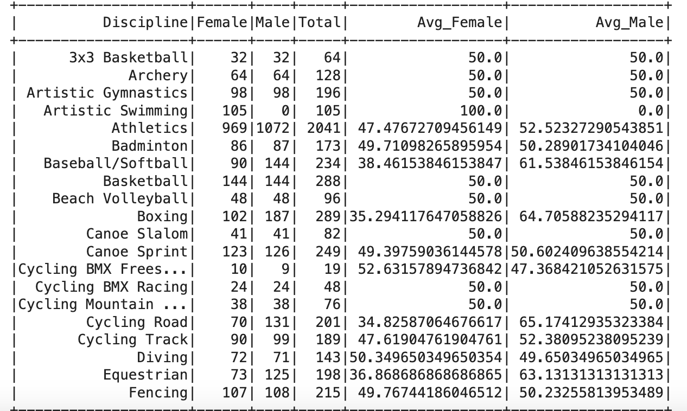

# Olympic-Data-Analytics-Using-Azure

## Abstract
The objective of this project is to build a ETL-pipeline using azure data factory to extract data from source to data lake for cleaning and transformation using 
azure data bricks then loading this data again into the datalake to apply some analytics on it using azure synapse analytics, finally using 
Power BI to create a dynamic dashboard that allows visualize data to have a better understanding.

## Dataset
This contains the details of over 11,000 athletes, with 47 disciplines, along with 743 Teams taking part in the 2021(2020) Tokyo Olympics.
This dataset contains the details of the Athletes, Coaches, Teams participating as well as the Entries by gender. It contains their names, countries represented, discipline, gender of competitors, name of the coaches.
- Source: Tokyo Olympics 2020 Website.

## Build ETL pipeline 
Process the data and load it into Data lake to be ready for further analysis using Azure Synapse Analytics. 
  
### 1- Data Extraction:  
- Create Data Factory 
- Create our container which represent the Data Lake 
- Ingest the olympic dataset from it's source using data factory service into our data lake. 

### 2- Data Exploration(EDA) and Visualization:
- Create Azure Data Bricks Work space.
- Create a new compute.
- Create App Registrations to get the credentials needed.
- Connect the Azure Data Bricks with Azure Data Lake by mounting Data Lake files into Data Bricks.

### 3- Data Exploration(EDA) and Visualization:
- Load the dataset.
- Explore the dataset and ask questions to give a better understanding of the data provided to you.
- Use data visualization to answer these questions.

### 4- Data Cleaning:
- Observe missing data, and data missing strategy(MCAR, MAR, or MNAR).
- Observe duplicate data.
- Observe outliers.
- After observing outliers, missing data, and duplicates, handle any noisy data.

### 5- Data Transformation and Feature Engineering:
- Check the data type of features.
- Add a new column.
- Encode any categorical features.
- Identify feature(s) which need normalization and show the reasoning. Then choose a technique to normalize the feature(s).

### 6- Data Loading:
- load the data after cleaning and transformation (preprocessing) again into Data Lake which is ready for Further analytics.

